# Mise en oeuvre d'une architecture micro-services

## Customer Microservice

** **
&#8594; Structure de project

&#8594; Swagger API

&#8594; test each API

* get all customers

* add customer

* get customer by ID

## Billing Microservice

** **
&#8594; Structure de project

&#8594; Swagger API

&#8594; test each API

* get all invoices

* add invoice to specific customer

* get invoices for a customer by customerID

* get invoice by ID

## Eureka Discovery service

** **
&#8594; Eureka configuration

&#8594; Customer and billing microservices are registerd with Eureka

* Billing service configuration

* Customer service configuration

## Spring cloud gateway 

** **
&#8594; gateway configuration

* gateway is registered with Eureka

&#8594; Gateway test

## conteneuriser ces microservices à l'aide de Docker

** **

### Customer service

* customer service dockerfile

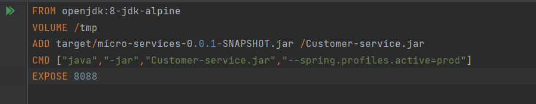

* building customer service image

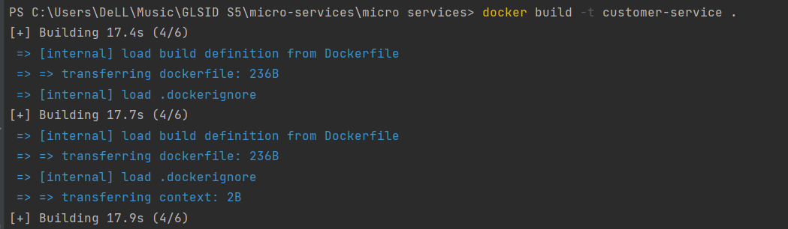

* verification d'image

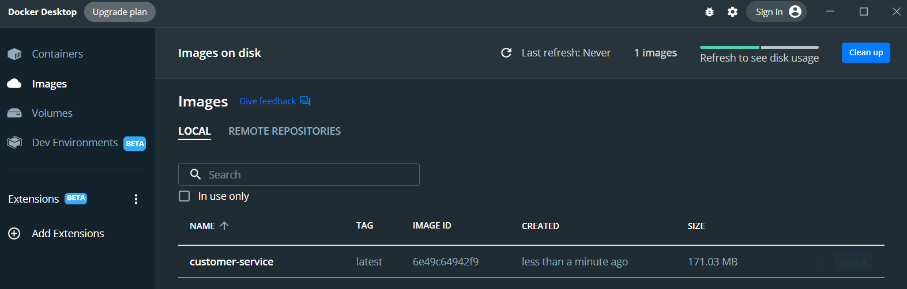

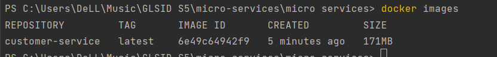

### Billing service

* billing service dockerfile

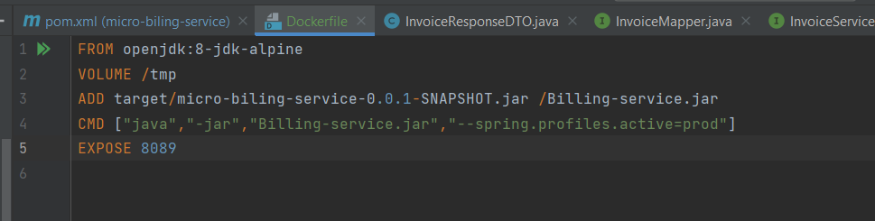

* building billing service image

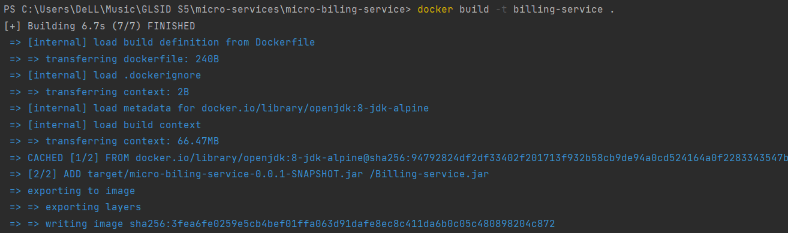

* verification d'image

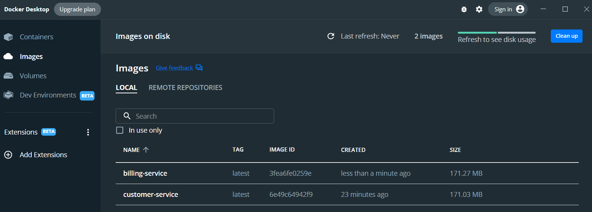

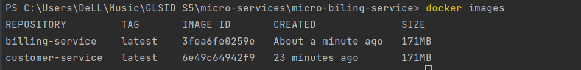

### Eureka service

* Eureka service dockerfile

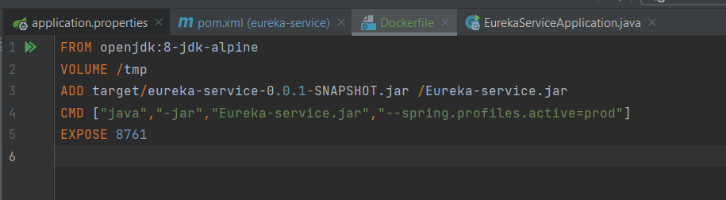

* building Eureka service image

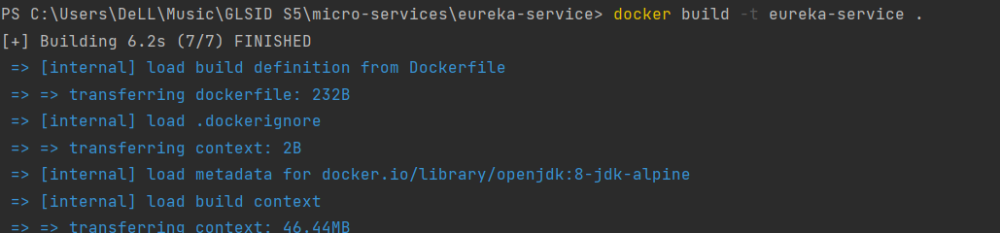

* verification d'image

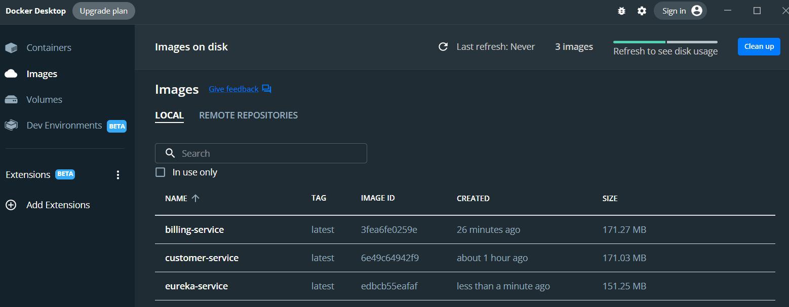

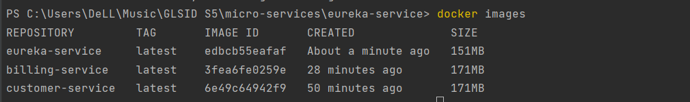

### Gateway service

* Gateway service dockerfile

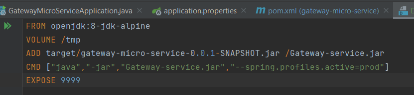

* building Gateway service image

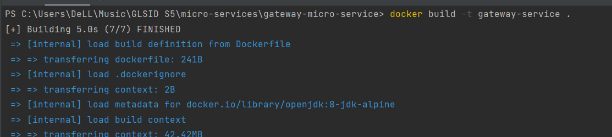

* verification d'image

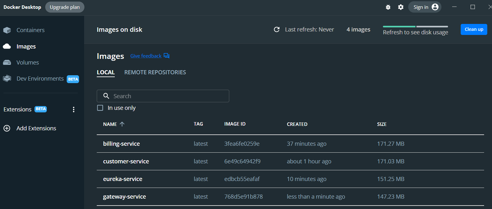

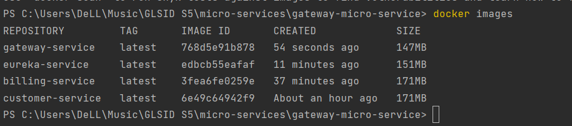

## orchestrer à l'aide de Docker

** **

* run all images 

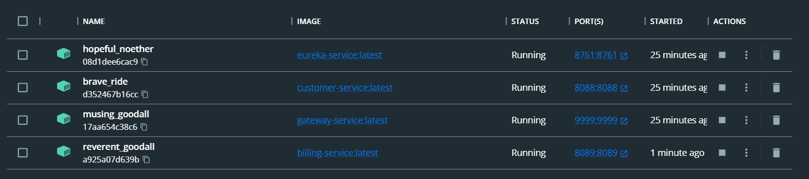

* Testing

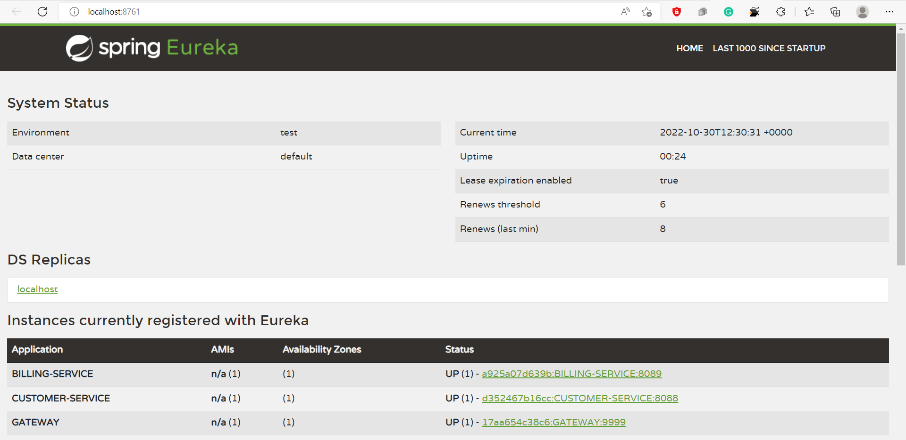

