# Mise en oeuvre d'une architecture micro-services

## Customer Microservice

** **
&#8594; Structure de project

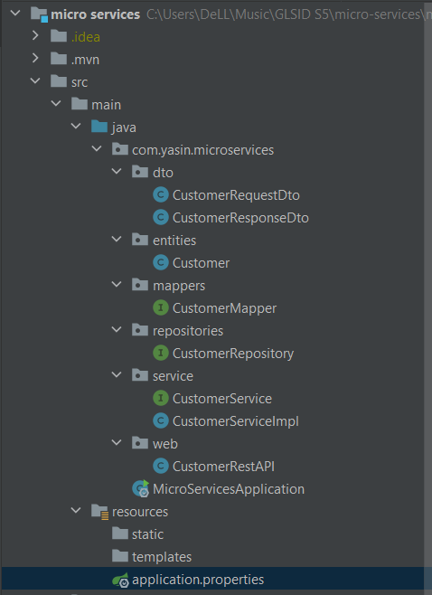

&#8594; Swagger API

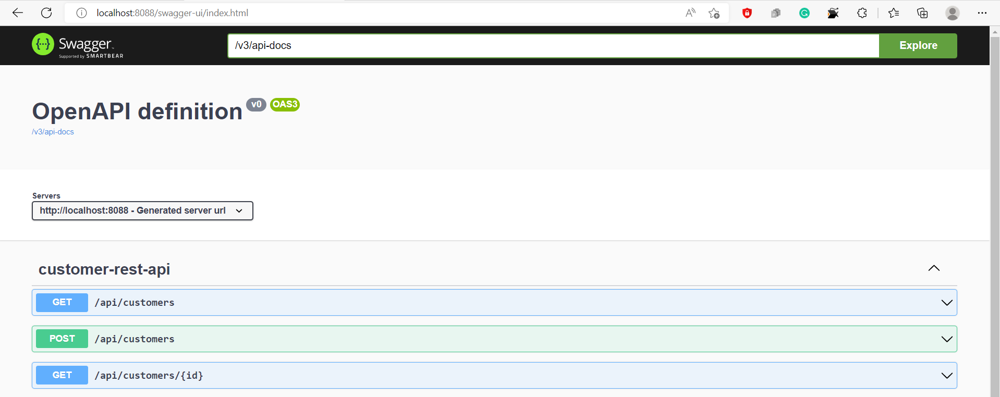

&#8594; test each API

* get all customers

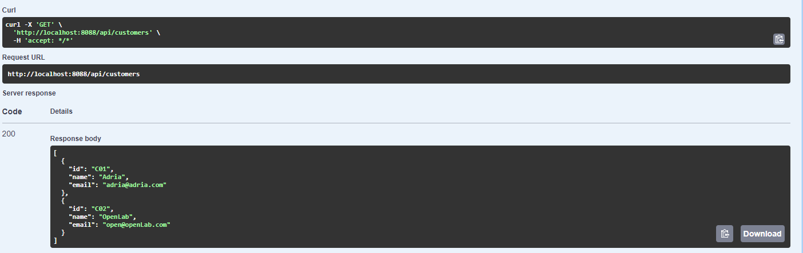

* add customer

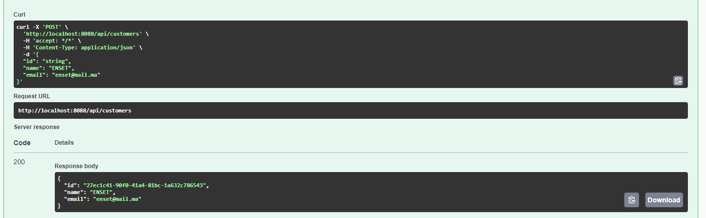

* get customer by ID

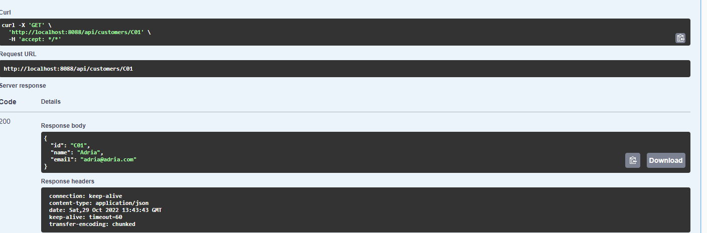

## Billing Microservice

** **
&#8594; Structure de project

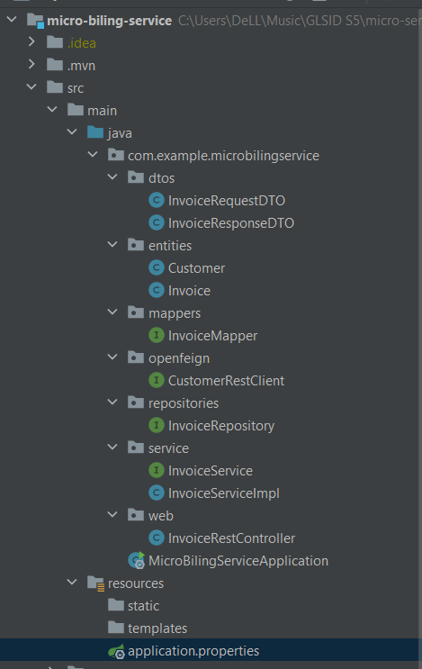

&#8594; Swagger API

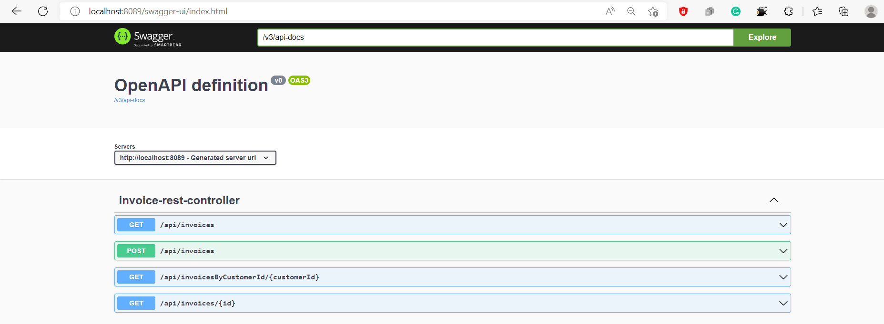

&#8594; test each API

* get all invoices

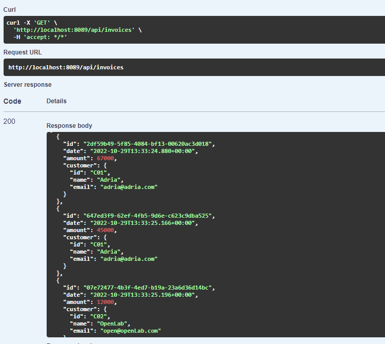

* add invoice to specific customer

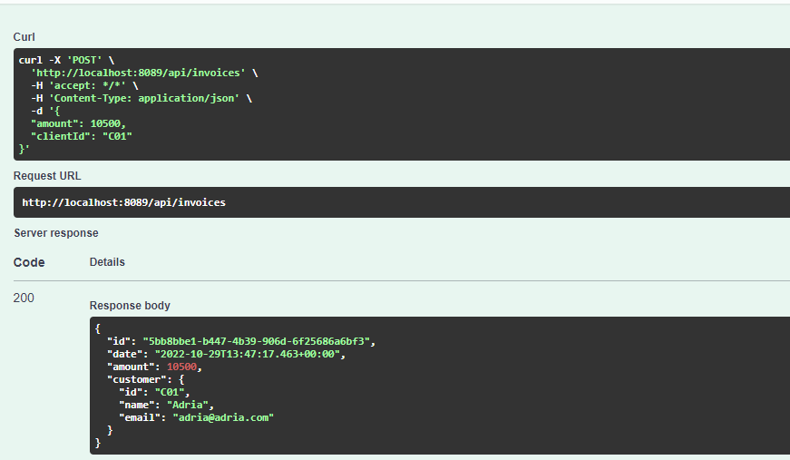

* get invoices for a customer by customerID

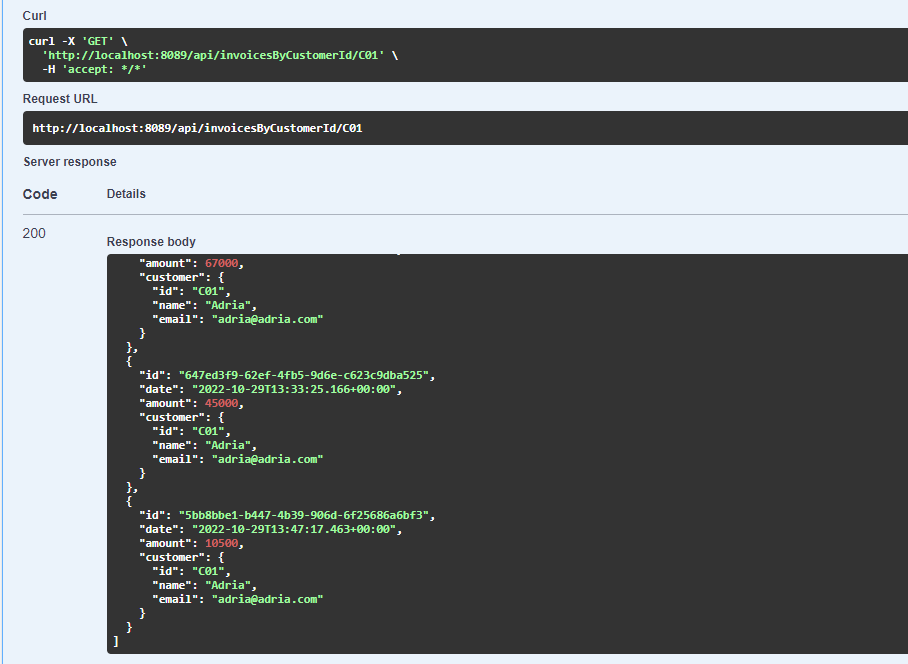

* get invoice by ID

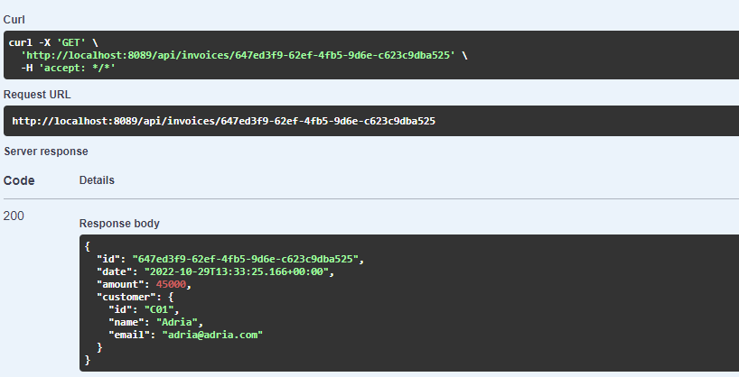

## Eureka Discovery service

** **
&#8594; Eureka configuration

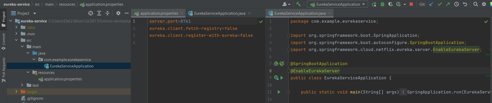

&#8594; Customer and billing microservices are registerd with Eureka

* Billing service configuration

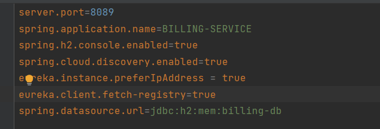

* Customer service configuration

## Spring cloud gateway 

** **
&#8594; gateway configuration

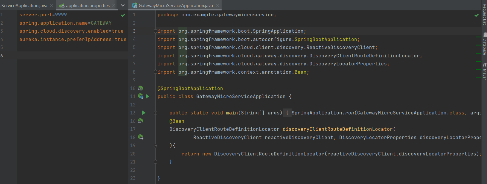

* gateway is registered with Eureka

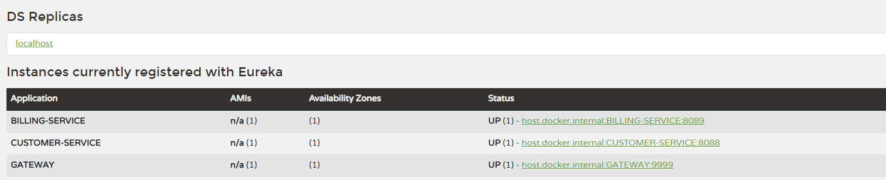

&#8594; Gateway test

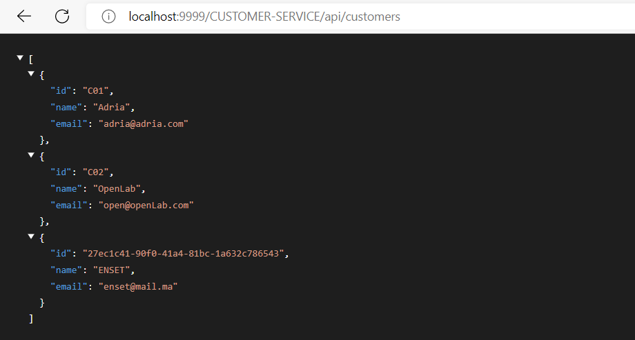

