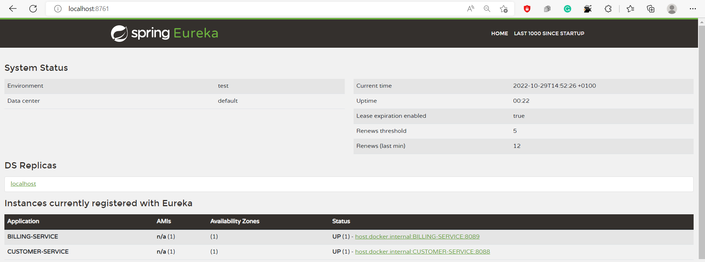

# Mise en oeuvre d'une architecture micro-services

## Customer Microservice

** **
&#8594; Structure de project

&#8594; Swagger API

&#8594; test each API

* get all customers

* add customer

* get customer by ID

## Billing Microservice

** **
&#8594; Structure de project

&#8594; Swagger API

&#8594; test each API

* get all invoices

* add invoice to specific customer

* get invoices for a customer by customerID

* get invoice by ID

## Eureka Discovery service

** **
&#8594; Eureka configuration

&#8594; Customer and billing microservices are registerd with Eureka

* Billing service configuration

* Customer service configuration

## Spring cloud gateway 

** **
&#8594; gateway configuration

* gateway is registered with Eureka

&#8594; Gateway test

## conteneuriser ces microservices à l'aide de Docker

** **

### Customer service

* customer service dockerfile

* building customer service image

* verification d'image

### Billing service

* billing service dockerfile

* building billing service image

* verification d'image

### Eureka service

* Eureka service dockerfile

* building Eureka service image

* verification d'image

### Gateway service

* Gateway service dockerfile

* building Gateway service image

* verification d'image

## orchestrer à l'aide de Docker

** **

* run all images 

* Testing

